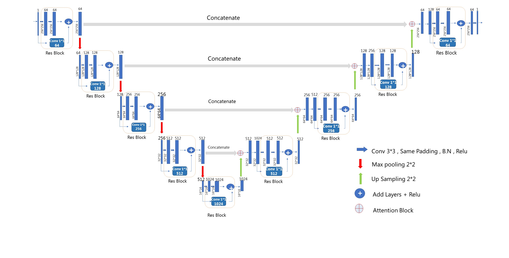
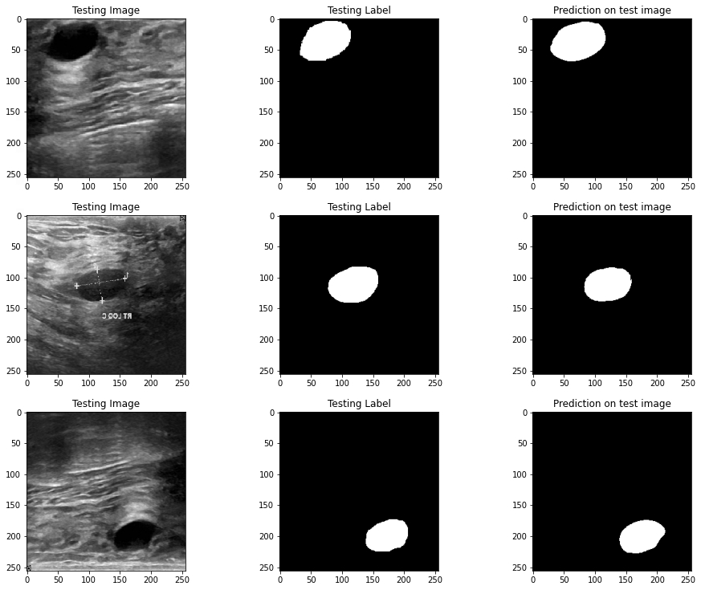
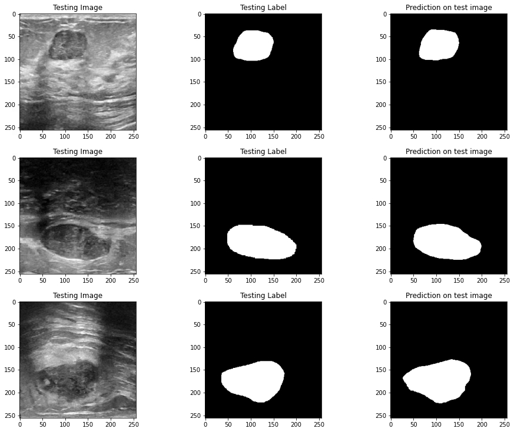

# Breast Mass Segmentation in Ultrasound Images

### U-Net with Attention-Residual High-Resolution Feature Enhancement

> Deep learning framework for automatic breast mass segmentation in ultrasound images using an enhanced U-Net architecture with attention and residual high-resolution feature enhancement.

> ## Overview

Breast ultrasound imaging is widely used for breast lesion assessment, but accurate segmentation of breast masses remains challenging because of low contrast, speckle noise, irregular lesion boundaries, and visual similarity between lesions and surrounding tissue.

This project investigates an enhanced U-Net-based architecture for automatic breast mass segmentation. The proposed framework incorporates attention and residual high-resolution feature enhancement mechanisms to improve feature representation and preserve fine-grained spatial information during encoder-decoder processing.

## Methodology

The proposed architecture extends the conventional U-Net encoder-decoder framework with resolution enhancement mechanisms designed to preserve and refine spatial information throughout the network.

The model integrates:

- **U-Net** for encoder-decoder based segmentation
- **Residual blocks** for feature refinement and improved information flow
- **Attention blocks** to emphasize relevant regions of interest
- **Resolution enhancement blocks** to preserve high-resolution spatial features
- **Skip connections** to reduce information loss between encoder and decoder stages

The overall objective is to improve segmentation of breast masses in ultrasound images where low image quality, speckle noise, and indistinct lesion boundaries make accurate segmentation challenging.

## Model Architecture

The proposed architecture builds upon the U-Net encoder-decoder framework and introduces attention and residual feature enhancement mechanisms to improve multi-scale feature representation.

  

### Key Design Concepts

- Encoder-decoder architecture
- Multi-scale feature extraction
- Residual feature refinement
- Attention-based feature weighting
- High-resolution feature preservation
- Skip connections for spatial information recovery

## Results

The proposed resolution-enhanced U-Net demonstrated strong performance for breast mass segmentation in ultrasound images.

| Metric | Benign | Malignant |
|---|---:|---:|
| **Dice** | **84.72%** | **82.14%** |
| **IoU** | **85.95%** | **82.21%** |

**Overall segmentation accuracy: 98.84%**

The results indicate that incorporating residual and attention-based resolution enhancement blocks into the U-Net architecture can improve feature preservation and segmentation performance compared with conventional U-Net-based approaches.

### Qualitative Results

  

  

